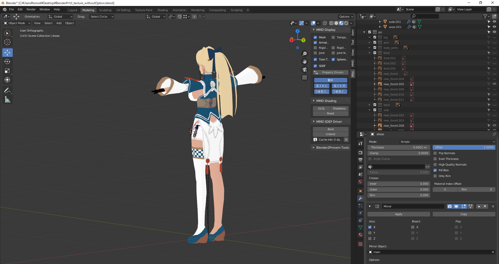

# Portfolio
西川　智之
## 概要
- 近畿大学電子計算機研究会所属
    - 副会長(3年生在籍時) 

## 研究会で参加したプロジェクト・チーム
- 競技プログラミング 
    - Atcoder　[マイページ](https://atcoder.jp/users/Tomoe6)
- 機械学習
    - 班員がそれぞれの興味がある機械学習に関係のある技術ついて学習し、持ち回りで学習した内容について発表した
- webアプリ開発
    - フロントエンドを担当
    - Vue.jsを用いた
- live2d
    - Cubism Live2Dを用いたLive2Dモデル制作の初歩を学んだ
- Unity
    - Unityに関する知識・技術の共有を行った
- 深層学習
    - [「作りながら学ぶ!PyTorchによる発展ディープラーニング」(amazon)](https://www.amazon.co.jp/dp/B07VPDVNKW)を用いた勉強会

## 制作物

- **LINEのbot** [リポジトリ](https://github.com/setsuha7242/LINEbot-MojiMoji-)
    - 日本語を送るとオウム返しする
    - 他言語を送ると日本語に翻訳して返す
    - 文字の写った画像を送ると写った文字をテキストで返す(OCR)
    - 今日の天気を決まった時間に通知する
- **pix2pixでの自動着色** [リポジトリ](https://github.com/setsuha7242/pix2pix_astolfo)
    - 精度は低い
- **アイドルタイプ判別機** [リポジトリ](https://github.com/setsuha7242/Idol_type_Cheaker)
    - 名前からCo,Pa,Cuを判別する
- **UML図の自動生成** [リポジトリ](https://github.com/setsuha7242/makeUxf)
    - Java言語のソースコードからUML図を生成する
- **砂のように消えるShader** [Qiita](https://qiita.com/Tomoe6/items/fd447bb2b4a77fb93a4e)
    - Unityで砂のように消えるShaderを作成した
- **3Dモデリング**
    - Blenderを使いキャラクターモデルの作成に挑戦した
    
    
    

- **CHIMERAND** [配布URL(Google Drive)](https://drive.google.com/drive/u/0/folders/11UyGX6TNc5eWUzLs7o0QXUKfu4GE-4nQ)
    - 部内ハッカソンでチームでUnityゲームを作成した
    - メインプログラマーを担当
- **お絵かきチャットアプリ** [リポジトリ](https://github.com/setsuha7242/DrawingChat)
    - 講義の一環としてチームでwebアプリを作成しました.
